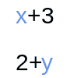
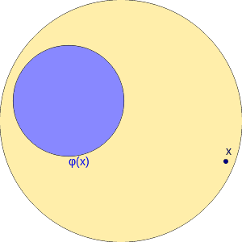

# gifedit

This tool enables to create GIF animations from simple Javascript code. See https://francoisschwarzentruber.github.io/gifedit/

# Examples of GIF created with that tool

# How does it work?

1) Write Javascript code (see below)
2) Click on the `Generate GIF` button to obtain your GIF animation.

# Javascript description of your GIF

For initialisation:

     init({width: 120, height: 90});
     
Then just draw, using the 2D context object is `ctx` and using the HTML5 Canvas API.
For clearing the image, call `clear();`

To a frame to the animation, call `addFrame({delay: 1000});`

That is it!

# Credits

This tool is based on https://github.com/jnordberg/gif.js
